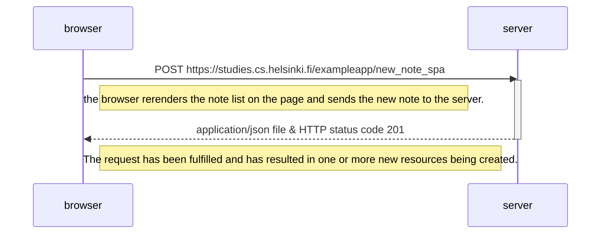

```mermaid
sequenceDiagram
    participant browser
    participant server

    browser->>server: POST https://studies.cs.helsinki.fi/exampleapp/new_note_spa
    activate server

    Note right of browser: the browser rerenders the note list on the page and sends the new note to the server.

    server-->>browser: application/json file & HTTP status code 201
    deactivate server

    Note left of server: The request has been fulfilled and has resulted in one or more new resources being created.
```
